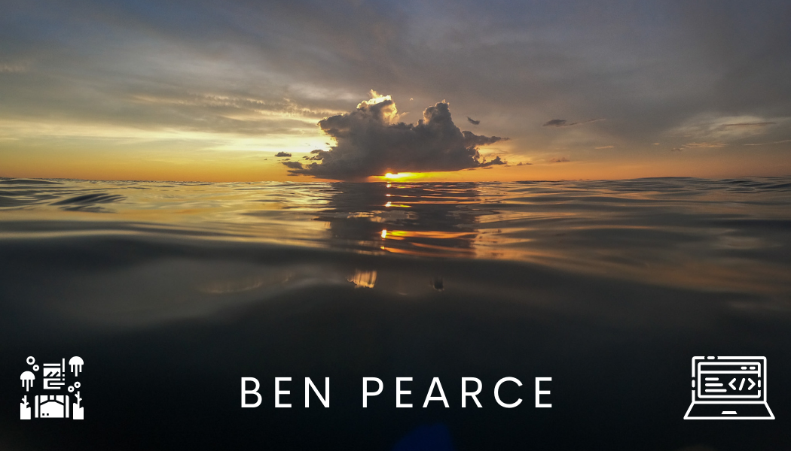

I am a full stack developer who gets a kick out of writing clean, readable code that has a purpose. Recently I have been working on projects involving React, Redux, TypeScript, Express, Sequelize and Docker.

 

<code>
</code>
<code></code>
<code></code>
<code></code>
<code></code>
<code></code>
<code></code>
<code>
</code>

 

### What am I up to?

- 🔭 I'm currently using what I learnt developing [Librai](https://github.com/geroalexander/librai) to refactor [BarTinder](https://github.com/IB3N/BarTinder) for efficiency and to use Redux
- 🌱 I’m excited to learn ☝️ more about **Typescript**, ✌️ **Nest.JS** and 🤟 **animations**
- ⏱ Free time? I love scuba and free diving, cycling, rock climbing and anything that will get me outdoors 🤿 🚴 🧗 ⛰

 

<!--
**IB3N/IB3N** is a ✨ _special_ ✨ repository because its `README.md` (this file) appears on your GitHub profile.

Here are some ideas to get you started:

- 🔭 I’m currently working on ...
- 🌱 I’m currently learning ...
- 👯 I’m looking to collaborate on ...
- 🤔 I’m looking for help with ...
- 💬 Ask me about ...
- 📫 How to reach me: ...
- 😄 Pronouns: ...
- ⚡ Fun fact: ...
-->
